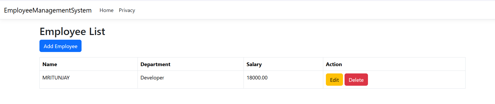
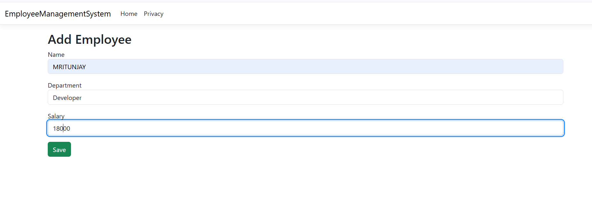

# Employee Management System

A web-based Employee Management System developed using ASP.NET Core MVC, C#, SQL Server, and Entity Framework Core. This application helps manage employee records with full CRUD functionality and responsive UI design.

---

## Features

- Add Employee Records
- Update Employee Details
- Delete Employees
- View Employee List
- Form Validation
- Responsive User Interface

---

## Technologies Used

- ASP.NET Core MVC
- C#
- SQL Server
- Entity Framework Core
- Bootstrap
- HTML/CSS
- Git & GitHub

---

## Project Architecture

The project follows the MVC (Model-View-Controller) architecture:

- **Models** → Handles application data
- **Views** → User Interface
- **Controllers** → Application logic
- **Data** → Database context and configuration

---

## Screenshots

### Employee List


### Add Employee



---

## How to Run the Project

### Clone Repository

```bash
git clone https://github.com/mritunjay11/EmployeeManagementSystemProject.git
